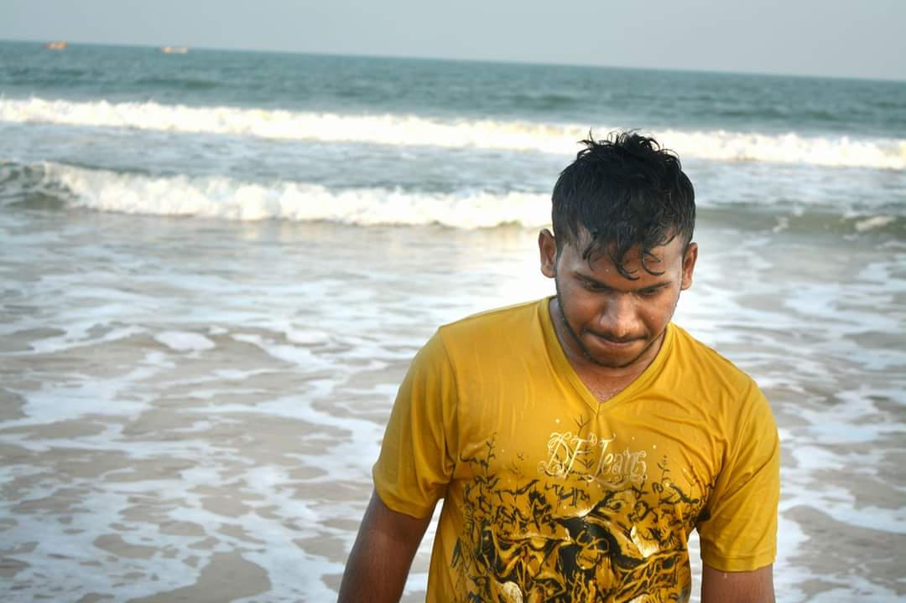

# Venkata Rami Reddy Yarram
I've done my undergraduation in CVR college of Engineering in Mechanical Stream with 73.08% in 2017. I got placed in Tech Mahindra while I was in 3rd year 2nd semester. I joined Tech Mahindra on July 19th 2018 and worked there for 4 years and 2 months as Sr.Software Engineer. My hobbies are playing cricket and badminton.
